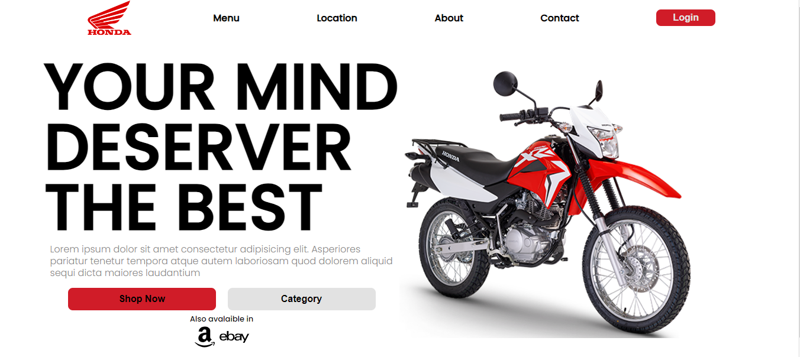

# Proyecto de Tarjeta de Concesionario de Moto

Este proyecto es una pequeña aplicación web desarrollada con React y estilos en CSS para simular una página inicial de un concesionario de motocicletas.

## Funcionalidades Principales

- **Tarjeta de Producto**: Muestra información detallada del producto, incluyendo imagen, modelo y características principales.

- **Interfaz Intuitiva**: Diseño simple y fácil de usar para la visualización de productos.
- 
## Diseño Responsivo

 Por el momento, este proyecto está optimizado para pantallas grandes y no tiene un diseño completamente responsive. Se recomienda visualizar la aplicación en dispositivos con pantallas más grandes para una mejor experiencia de usuario.
 
## Capturas de Pantalla


Muestra de como se ve actualmente.


## Instalación

1. Clona el repositorio:

   ```bash
   git clone https://github.com/mackaroots/cardHonda.git
